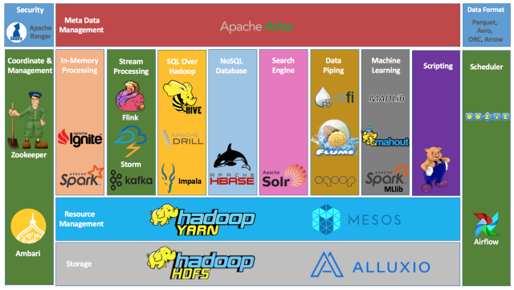

# Table of Contents

1.  [Abertura - Como trabalhar em um ambiente ágil e global](#orgd088cea)
2.  [Monitoramento de clusters Hadoop de alto nível com HDFS e Yarn](#orgd332023)
    1.  [Sistemas distribuídos](#org811d866)
    2.  [Hadoop](#org5157e8a)
3.  [Orquestrando ambientes de big data distruibuidos com Zookeeper, Yarn e Sqoop](#org795090c)
    1.  [Zookeepr](#org44687a8)
    2.  [Sqoop](#org4090769)
    3.  [Recursos](#orgfef3314)
4.  [Como realizar consultas de maneira simples no ambiente complexo de Big Data com HIVE e Impala](#org70fea50)
5.  [Explorando o poder do NoSQL com Cassandra e Hbase](#orgb7d9a23)
6.  [Intensivo de Python: O mínimo que você precisa saber](#orgad4138c)
7.  [Trabalhando com serviços de mensageria real time com Python e Kafka na prática](#org57d8315)
8.  [Processando grandes conjuntos de dados de forma paralela e distribuída com Spark](#org47ff131)
9.  [Criando pipelines de dados eficientes - Parte 1](#orgcb61939)
10. [Criando pipelines de dados eficientes - Parte 2](#org98f7936)
11. [Orquestrando Big Data em Ambiente de Nuvem](#orgcd6bcca)
12. [Scala: o poder de uma linguagem multiparadigma](#org450c9ca)
13. [O que você precisa saber para construir APIs verdadeiramente restfull](#orgdb84bbf)

# Abertura - Como trabalhar em um ambiente ágil e global

A live começou com a apresentação da Everis, empresa de consultoria
multinacional que estará ministrando as palestras técnicas sobre o assunto de
Big Data. Entraram em detalhes da filosofia e cultura da empresa, bem como
ressaltaram que há oportunidades na área de Dados e que poderão ser oferecidas
aos alunos de destaque do curso ao fim do treinamento.

Ressaltaram que tiveram um total de 2000 candidaturas. Por volta de 400 foram
selecionados após realizar uma prova eliminatória. Prova contou com questões de
multipla escolha sobre Python e lógica de programação, além de um coding test.

A seguir trataram um pouco sobre principais tecnologias que serão cobertas ao
longo do curso. Serão 14 dias de treinamento passando pelas linguagens de
programação Python e Scala. Também serão dadas noções do core Hadoop com HDFS,
Yarn, além de outras ferramentas do ecossistema como MapReduce, Sqoop, Hive,
Zookeeper e Spark. Também serão cobertas noções de bancos de dados NoSQL como
Cassandra e HBase.

Ao longo da apresentação também focaram na importância da mudança do paradigma
Waterfall para o paradigma Agile para projetos de Engenharia de Dados.
Planejamento e execução de Sprints, Dailies, Reviews, organização em Squads
autosuficientes, constante interação com o cliente, foco na entrega. São algumas
das características essenciais da cultura Agile. Agile requer um processo de
comunicação forte, com transparência, confiânça e união entre os colaboradores
das Squads. No geral, focaram no fato de que colaboração é um aspecto
fundamental do framework Agile.

# Monitoramento de clusters Hadoop de alto nível com HDFS e Yarn

## Sistemas distribuídos

Clusters de computadores hoje em dia são uma alternativa aos antigos mainframes.
Enquanto mainframes conseguem oferecer escalabilidade vertical, cluters
conseguem oferecer escalabilidade horizontal. Isso é, para conseguir mais
recursos de armazenamento e computação para os mainframes você precisa

Nesse contexto, demos início ao estudo do Hadoop, uma tecnologia desenvolvida
utilizando princípios de sistemas distribuídos e que, portanto, se encaixam
nessa nova realidade dos clusters. Passamos por uma descrição alto nível do que
acontece por debaixo dos panos quando nós, desenvolvedores, interagimos com o
HDFS e Yarn.

## Hadoop

Essas duas tecnologias são as peças fundamentais que sustentam o ecossistema
Hadoop. Os nomes HDFS e Yarn podem parecer uma sopa de letrinhas sem muito
sentido para quem os vê fora de contexto. Mas note que ambos na verdade são
siglas bastante descritivas do que essas tecnologias se propõem a fazer.

O HDFS, ou Hadoop Distributed File System, fica encarregado de distribuir e
gerenciar os seus arquivos entre as máquinas do seu cluster. Já o Yarn, Yet
Another Resource Negotiator, é responsável por negociar recrusos computacionais
para as suas tarefas de manipulação de dados.

Créditos: <https://dzone.com/articles/example-of-etl-application-using-apache-spark-and>

# Orquestrando ambientes de big data distruibuidos com Zookeeper, Yarn e Sqoop

## Zookeepr

Serviço de coordenação distribuído.
Fornece as rotas necessárias para as peças do cluster. Identifica nós por nomes (DSN-like).
Ajuda as peças do ecossitemas Hadoop se achar na bagunça toda.
Pode ajudar a evitar concorrência (write on read).
Ajuda na recuperação de falhas.

Para o desenvolvedor, o Zookeeper é completamente transparente.
É mais aparente para quem vai trabalhar com infra.

## Sqoop

Movimenta dados entre banco de dados relacional e HDFS.
Realiza a leitura linha a linha de tabelas para arquivos (pode pecar na performance).
Permite importar dados e metadados de bancos de dado relacionais direto para o Hive.
Utiliza MapReduce por debaixo dos panos: processamento paralelo e tolerante a falha. Contudo MapReduce já não é mais o motor mais rápido disponível (alternativas: Spark, Flink).

    sqoop import \
        --connect jdbc: \
        --username abc \
        --password xyz \
        --table some_table \
        --where "column='something'"

### Desafio

1.  SQL

    1.  Todos os Pokémon lendários
        
            SELECT *
            FROM trainning.pokemon
            WHERE legendary=TRUE;
    2.  Todos os Pokémon de apenas um tipo
        
            SELECT *
            FROM trainning.pokemon
            WHERE type2='';
    3.  Os top 10 Pokémon mais rápidos
        
            SELECT *
            FROM trainning.pokemon
            ORDER BY speed DESC
            LIMIT 10;
    4.  Os top 50 Pokémon com menos HP
        
            SELECT *
            FROM trainning.pokemon
            ORDER BY hp ASC
            LIMIT 50;
    5.  Os top 100 Pokémon com maiores atributos
        
            SELECT *
            FROM trainning.pokemon
            ORDER BY
            greatest(hp, attack, defense, spatk, spdef, speed)
            DESC
            LIMIT 100;

2.  Sqoop

## Recursos

<http://dontpad.com/aceleracaoeveris>

<https://drive.google.com/drive/folders/1xaft6H3R3_UvA6-BFHuCvHuWczf6xwqG?usp=sharing>

# Como realizar consultas de maneira simples no ambiente complexo de Big Data com HIVE e Impala

# Explorando o poder do NoSQL com Cassandra e Hbase

# Intensivo de Python: O mínimo que você precisa saber

# Trabalhando com serviços de mensageria real time com Python e Kafka na prática

# Processando grandes conjuntos de dados de forma paralela e distribuída com Spark

# Criando pipelines de dados eficientes - Parte 1

# Criando pipelines de dados eficientes - Parte 2

# Orquestrando Big Data em Ambiente de Nuvem

# Scala: o poder de uma linguagem multiparadigma

# O que você precisa saber para construir APIs verdadeiramente restfull

